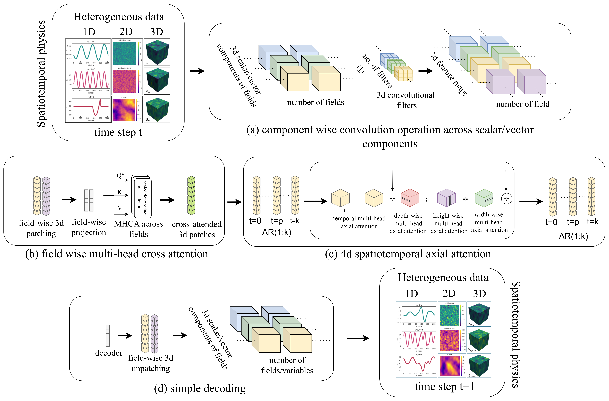

<div align="center">
<h1>MORPH: Shape-agnostic PDE foundational models</h1>
</div>

<p align="center">
  
</p>

### Clone the repository
To clone the repository, click on top-right 'code' and select 'clone with HTTPS' and copy the code path and paste in the terminal.
```
git clone https://github.com/lanl/MORPH.git
```
Go to the directory
```
cd MORPH
```

### Install the requirements
- Install dependencies via environment.yml
```
conda env create -f environment.yml
```
- Activate the environment
```
conda activate pytorch_py38_env
```
- Install pytorch
```
pip3 install torch torchvision torchaudio --index-url https://download.pytorch.org/whl/cu118                    
```
- Check pytorch installation
```
python -c "import torch; print('PyTorch version:', torch.__version__); print('CUDA available:', torch.cuda.is_available())"
```
Output: 
PyTorch version: 2.4.1+cu118
CUDA available: True

### Run the scripts
#### 1. Pretraining script
- Check arguments:
```
python scripts/pretrain_MORPH.py -h 
```

#### 2. Finetuning script
- Check arguments:
```
python scripts/finetune_MORPH.py -h
```

#### 3. Inference script

Check arguments:
```
python scripts/infer_MORPH.py -h
```

If you use MORPH in your research, please cite:
```
@misc{rautela2025morphshapeagnosticpdefoundation,
  title={{MORPH}: Shape-agnostic {PDE} Foundation Models},
  author={Mahindra Singh Rautela and Alexander Most and Siddharth Mansingh and Bradley C. Love and Ayan Biswas and Diane Oyen and Earl Lawrence},
  year={2025},
  eprint={2509.21670},
  archivePrefix={arXiv},
  primaryClass={cs.CV},
  url={https://arxiv.org/abs/2509.21670}
}
```

----------
<div align="center">
<h1>Note: EIDR number O#4999 - MORPH: Shape-agnostic PDE Foundational Models. This program is Open-Source under the BSD-3 License.</h1>
</div>
----------


