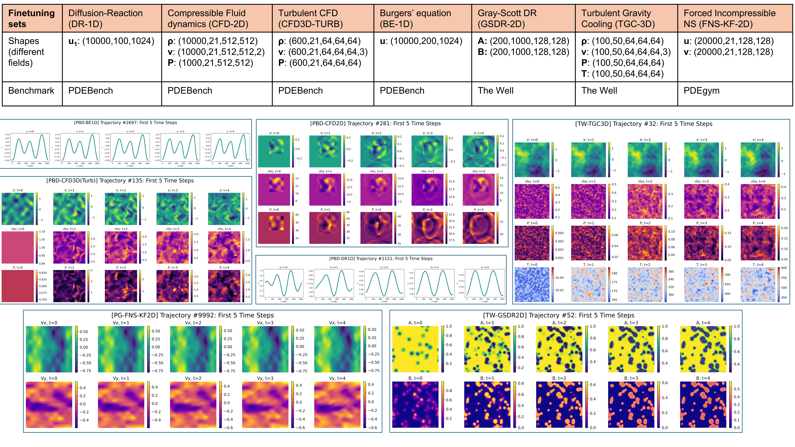

<div align="center">

# MORPH: PDE Foundation Models with Arbitrary Data Modality

<a href="https://mahindrautela.github.io/morph/"></a>
<a href="https://arxiv.org/abs/2509.21670"></a>
<a href="https://huggingface.co/mahindrautela/MORPH"></a>

</div>

MORPH is a multimodal PDE foundation model designed to learn across heterogeneous scientific datasets with different spatial dimensions (1D–3D), resolutions, and physical fields. It is pretrained across diverse PDE systems and transferred to downstream tasks including autoregressive rollouts, terminal key-frame prediction, composite material property estimation, structural damage detection, inertial-confinement-fusion parameter estimation, and sparse sea-surface-temperature reconstruction.

The figure below summarizes the MORPH architecture and its unified treatment of heterogeneous scientific data.

<p align="center">
  
</p>

<div align="center">

### Pretraining Sets

</div>

<p align="center">
  
</p>

<div align="center">

### Finetuning Sets (Fluid Systems - Autoregressive Rollouts)

</div>

<p align="center">
  
</p>

---

## User Guide

The guide for using MORPH as a standalone surrogate model and as a foundation model is available in [`./docs`](./docs).

## Installation

MORPH is packaged as `morph-pde` and can be imported as:

```python
from morph_pde import MORPH
```

### Install from the current integration branch

While the NOMAD/MCP integration is being developed on `morph-nomad-integration`, install this branch directly with:

```bash
python -m pip install "git+https://github.com/lanl/MORPH.git@morph-nomad-integration"
```

For development, clone the branch and install MORPH in editable mode:

```bash
git clone -b morph-nomad-integration https://github.com/lanl/MORPH.git
cd MORPH
python -m pip install -e .
```

Optional development dependencies can be installed with:

```bash
python -m pip install -e ".[dev]"
```

For GPU support, install a PyTorch build compatible with your CUDA environment before installing MORPH. See the official PyTorch installation instructions at <https://pytorch.org/get-started/locally/>.

A quick installation check is:

```bash
python -c "from morph_pde import MORPH; print(MORPH)"
```

> **Note:** Core MORPH currently supports Python 3.8+. The NOMAD/MCP integration described below requires Python 3.12+.

---

## NOMAD / MCP Integration

MORPH can be exposed as a Model Context Protocol (MCP) tool using [LANL NOMAD](https://github.com/lanl/nomad). This allows MCP-compatible clients and AI agents to call MORPH through a standard tool interface.

The current integration exposes the MORPH-Ti foundation model through:

```text
MCP client / AI agent
        |
        v
      NOMAD
        |
        v
     morph_ti
        |
        v
    MORPHTool
        |
        v
     MORPH-Ti
```

### Current scope

The current NOMAD adapter is a proof-of-concept integration for the MORPH-Ti flow-matching checkpoint. The MORPH-Ti architecture parameters are currently defined in `src/morph_pde/nomad_tool.py`, and the checkpoint is loaded from a local model directory.

The MCP tool accepts a MORPH state tensor with shape:

```text
(T, F, C, D, H, W)
```

and returns the predicted next state with shape:

```text
(F, C, D, H, W)
```

### 1. Create a Python 3.12 environment

For example, with Conda:

```bash
conda create -n morph_nomad python=3.12 -y
conda activate morph_nomad
```

Install a PyTorch build appropriate for your system, then install MORPH and NOMAD:

```bash
python -m pip install -e .
python -m pip install nomad-scifm
```

Verify the environment:

```bash
python --version
python -c "import torch; print('PyTorch:', torch.__version__); print('CUDA available:', torch.cuda.is_available())"
python -c "from morph_pde.nomad_tool import MORPHTool; print(MORPHTool)"
python -c "import nomad; print(nomad.__file__)"
```

NOMAD requires Python 3.12 or newer.

### 2. Prepare the MORPH-Ti checkpoint

Download the MORPH-Ti flow-matching checkpoint from the [MORPH Hugging Face repository](https://huggingface.co/mahindrautela/MORPH):

```text
morph-Ti-FM-max_ar1_ep225.pth
```

The current `nomad.yml` expects the checkpoint at:

```text
models/
└── morph-ti-fm/
    └── model.pth
```

If the checkpoint is already available under `models/FM/`, create the directory and copy it.

Linux/macOS:

```bash
mkdir -p models/morph-ti-fm
cp models/FM/morph-Ti-FM-max_ar1_ep225.pth models/morph-ti-fm/model.pth
```

Windows Command Prompt:

```bat
mkdir models\morph-ti-fm
copy models\FM\morph-Ti-FM-max_ar1_ep225.pth models\morph-ti-fm\model.pth
```

The checkpoint should remain outside Git; do not commit `model.pth`.

### 3. NOMAD configuration

The repository includes [`nomad.yml`](./nomad.yml):

```yaml
fmod_models:
  - model_class: morph_pde.nomad_tool.MORPHTool
    name_or_path: models/morph-ti-fm
    tool_name: morph-ti
    batch_size: 1
```

NOMAD exposes this model through MCP as the tool:

```text
morph_ti
```

### 4. Start the NOMAD MCP server

From the MORPH repository root, start the server in the first terminal:

```bash
nomad serve --transport http --host localhost --port 8000 nomad.yml
```

A successful startup should contain messages similar to:

```text
Registering torch model 'morph-ti'
Starting MCP server 'nomad' ... on http://localhost:8000/mcp
Application startup complete.
```

The MCP endpoint is:

```text
http://localhost:8000/mcp
```

Leave this terminal running while testing the MCP client.

If a CUDA device is available, NOMAD can move the model to the GPU when an inference request is received. The server log will show the device used, for example:

```text
Loading tool 'morph_ti' onto cuda:0
```

### 5. Verify MCP tool discovery

This step is optional but useful for checking the MCP interface.

Install Node.js if it is not already available, then run in a second terminal:

```bash
npx @modelcontextprotocol/inspector --cli http://localhost:8000/mcp --transport http --method tools/list
```

The returned tool list should include:

```text
get_model_card
morph_ti
```

Node.js is only required for the MCP Inspector check; it is not required for normal MORPH inference.

### 6. Run the end-to-end MCP test

With the NOMAD server still running in the first terminal, run:

```bash
python tests/test_mcp.py
```

The test:

1. creates one input tensor,
2. runs MORPH directly,
3. sends the same tensor through MCP,
4. receives the NOMAD/MORPH prediction, and
5. compares the direct and MCP outputs.

A successful run should look similar to:

```text
Input shape: (1, 1, 1, 1, 64, 64)
Direct output shape: (1, 1, 1, 64, 64)
Available tools: ['get_model_card', 'morph_ti']
MCP error: False
MCP output shape: (1, 1, 1, 64, 64)
Max abs diff: 0.0
Mean abs diff: 0.0
Match: True
```

The current integration test performs the direct comparison on `cuda:0`, so a CUDA-capable GPU is required to reproduce the exact test as currently written.

### 7. Stop the server

When finished, stop the NOMAD server with:

```text
Ctrl+C
```

### NOMAD/MCP troubleshooting

**`ModuleNotFoundError: No module named 'morph_pde.nomad_tool'`**

Make sure you are on the integration branch and installed the repository in editable mode:

```bash
git switch morph-nomad-integration
python -m pip install -e .
```

Confirm that Python is using the current checkout:

```bash
python -c "import morph_pde; print(morph_pde.__file__)"
```

**`ModuleNotFoundError: No module named 'nomad'`**

Install the NOMAD package:

```bash
python -m pip install nomad-scifm
```

**`FileNotFoundError` for `model.pth`**

Confirm that this file exists:

```text
models/morph-ti-fm/model.pth
```

**Port 8000 is already in use / Windows `WinError 10048`**

A NOMAD server is already running on port 8000. Do not start a second server. Stop the existing server with `Ctrl+C`, or use another port and update the MCP client URL accordingly.

**MCP Inspector shows `GET /mcp` with `405 Method Not Allowed`**

MCP communication uses the supported MCP HTTP requests. If `tools/list` and `tools/call` succeed, an isolated browser/Inspector `GET` response is not an indication that MORPH inference failed.

### Current integration limitations

The current MCP integration is intentionally minimal:

- it currently targets the MORPH-Ti checkpoint;
- MORPH-Ti architecture parameters are currently specified in `nomad_tool.py`;
- the checkpoint is currently expected from local storage; and
- `tests/test_mcp.py` currently uses a synthetic tensor for the end-to-end equivalence test.

Future integration work can move the model configuration into a model artifact such as 
- `config.json`, 
- add a complete model card, 
- host the NOMAD-ready artifact on Hugging Face, 
- validate a real PDE sample, and 
- use the same adapter for additional MORPH model sizes.

---

## Citation

If you use MORPH in your research, please cite:

```bibtex
@article{rautela2025morph,
  title={MORPH: PDE Foundation Models with Arbitrary Data Modality},
  author={Rautela, Mahindra Singh and Most, Alexander and Mansingh, Siddharth and Love, Bradley C and Biswas, Ayan and Oyen, Diane and Lawrence, Earl},
  journal={arXiv preprint arXiv:2509.21670},
  year={2025}
}
```

#### Note

EIDR number **O#4999** — *MORPH: Shape-agnostic PDE Foundational Models.*

This program is Open-Source under the MIT License.
