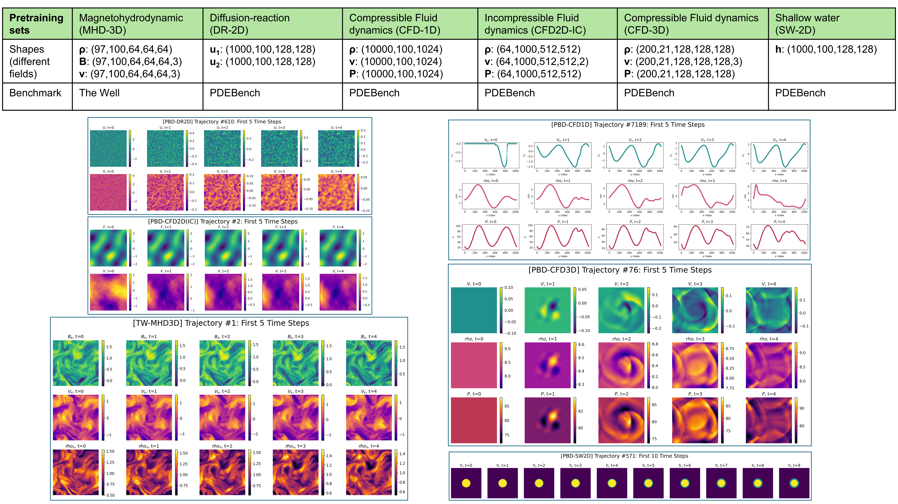

<div align="center">


# MORPH: PDE Foundation Models with Arbitrary Data Modality

<a href="https://mahindrautela.github.io/morph/"></a>
<a href="https://arxiv.org/abs/2509.21670"></a>
<a href="https://huggingface.co/mahindrautela/MORPH"></a>

</div>

MORPH is a multimodal PDE foundation model designed to learn across heterogeneous scientific datasets with different spatial dimensions (1D–3D), resolutions, and physical fields. It is pretrained across diverse PDE systems and transferred to downstream tasks including autoregressive rollouts, terminal key-frame prediction, composite material property estimation, structural damage detection, inertial-confinement-fusion parameter estimation, and sparse sea-surface-temperature reconstruction.

The figure below summarizes the MORPH architecture and its unified treatment of heterogeneous scientific data.

<p align="center">
  
</p>

<div align="center">

### Pretraining Sets

</div>

<p align="center">
  
</p>

<div align="center">

### Finetuning Sets (Fluid Systems - Autoregressive Rollouts)

</div>

<p align="center">
  
</p>

---

## User Guide

The guide for using MORPH as a standalone surrogate model and as a foundation model is available in [`./docs`](./docs).

## Installation

MORPH is packaged as `morph-pde` and can be imported as:

```python
from morph_pde import MORPH
```

### Install from the current integration branch

While the NOMAD/MCP integration is being developed on `morph-nomad-integration`, install this branch directly with:

```bash
python -m pip install "git+https://github.com/lanl/MORPH.git@morph-nomad-integration"
```

For development, clone the branch and install MORPH in editable mode:

```bash
git clone -b morph-nomad-integration https://github.com/lanl/MORPH.git
cd MORPH
python -m pip install -e .
```

Optional development dependencies can be installed with:

```bash
python -m pip install -e ".[dev]"
```

For GPU support, install a PyTorch build compatible with your CUDA environment before installing MORPH. See the official PyTorch installation instructions at <https://pytorch.org/get-started/locally/>.

A quick installation check is:

```bash
python -c "from morph_pde import MORPH; print(MORPH)"
```

> **Note:** Core MORPH currently supports Python 3.8+. The NOMAD/MCP integration described below requires Python 3.12+.

---

## NOMAD / MCP Integration

MORPH can be exposed as a Model Context Protocol (MCP) tool using [LANL NOMAD](https://github.com/lanl/nomad). The `morph-nomad-pli_t0_t99` branch demonstrates a real-data integration using a fine-tuned MORPH-S model for PLI terminal-frame prediction.

The demonstrated workflow is:

```text
PLI t=0 physical field
        |
        v
checkpoint-specific normalization
        |
        v
MORPH-S
        |
        v
denormalization
        |
        v
PLI t=99 prediction
        |
        v
NOMAD / MCP
```

### Current scope

The current integration uses a MORPH-S checkpoint fine-tuned to predict the final PLI frame (`t=99`) from the initial frame (`t=0`).

The MCP tool accepts an unnormalized MORPH state tensor in physical units with shape:

```text
(T, F, C, D, H, W)
```

and returns the prediction in physical units with shape:

```text
(F, C, D, H, W)
```

Normalization is performed internally by MORPH. The normalization statistics associated with the fine-tuned checkpoint are loaded from `normalization.npy`, and the model architecture is loaded from `config.yaml`.

For the current PLI checkpoint, the stored normalization statistics are the training/validation mean and variance, and the transformation is:

```text
x_normalized = (x - mean) / variance
```

The predicted field is transformed back to physical units before being returned through MCP.

### Install this branch

```bash
python -m pip install "git+https://github.com/lanl/MORPH.git@morph-nomad-pli_t0_t99"
```

For development:

```bash
git clone -b morph-nomad-pli_t0_t99 https://github.com/lanl/MORPH.git
cd MORPH
python -m pip install -e .
python -m pip install nomad-scifm
```

The NOMAD/MCP integration requires Python 3.12+.

### Prepare the PLI model artifact

Create:

```text
models/
└── morph-s-pli/
    ├── model.pth
    ├── normalization.npy
    └── config.yaml
```

`model.pth` is the fine-tuned MORPH-S checkpoint.

`normalization.npy` contains the normalization statistics associated with that checkpoint.

A reference model configuration is provided in:

```text
configs/morph-s-pli.yaml
```

Copy it into the model directory:

Linux/macOS:

```bash
mkdir -p models/morph-s-pli
cp configs/morph-s-pli.yaml models/morph-s-pli/config.yaml
```

Windows Command Prompt:

```bat
mkdir models\morph-s-pli
copy configs\morph-s-pli.yaml models\morph-s-pli\config.yaml
```

The checkpoint and dataset files should remain outside Git.

### NOMAD configuration

The branch uses:

```yaml
fmod_models:
  - model_class: morph_pde.nomad_tool.MORPHTool
    name_or_path: models/morph-s-pli
    tool_name: morph-s-pli
    batch_size: 1
```

NOMAD exposes the model through MCP as:

```text
morph_s_pli
```

### Start the NOMAD MCP server

From the repository root:

```bash
nomad serve --transport http --port 8181 nomad.yml
```

The MCP endpoint is:

```text
http://localhost:8181/mcp
```

A successful startup should include messages similar to:

```text
Registering torch model 'morph-s-pli'
Offloaded tool 'morph_s_pli' to CPU
Starting MCP server 'nomad' ... http://localhost:8181/mcp
Application startup complete.
```

When an inference request arrives, NOMAD can dynamically move the model to an available GPU:

```text
Loading tool 'morph_s_pli' onto cuda:0
```

### Real-data PLI integration test

Place the PLI input HDF5 file under the ignored `datasets/` directory and run:

```bash
python tests/test_mcp_pli.py \
    --input-h5 datasets/average_jet_first_frame_full_res.h5
```

The test reads:

```text
t0_fields/av_density
```

from the HDF5 file and performs three equivalent inference paths:

```text
1. manual normalization -> MORPH-S -> manual denormalization
2. normalization-aware MORPH wrapper
3. MCP -> NOMAD -> normalization-aware MORPH wrapper
```

The reference and MCP predictions are then compared numerically.

The validated PLI integration produced:

```text
Physical input shape: (1, 1, 1, 1, 1120, 400)

Reference vs wrapper max abs diff: 0.0
Reference vs wrapper match: True

Available tools: ['get_model_card', 'morph_s_pli']

Reference output shape: (1, 1, 1, 1120, 400)
MCP output shape: (1, 1, 1, 1120, 400)

Reference vs MCP max abs diff: 0.0
Reference vs MCP mean abs diff: 0.0
Reference vs MCP match: True
```

This verifies that checkpoint-specific normalization, MORPH inference, NOMAD device management, MCP transport, and denormalization reproduce the direct MORPH prediction exactly for the tested sample.

### Current integration limitations

The current integration is intentionally focused on validating one real scientific inference workflow.

* The demonstrated model is a fine-tuned MORPH-S checkpoint for PLI `t=0 -> t=99` terminal-frame prediction.
* `model.pth` and `normalization.npy` are currently expected from local storage and are not automatically downloaded.
* The MCP interface currently receives an already prepared MORPH tensor; HDF5 parsing is performed by the test/client rather than by the MCP tool.
* The current PLI normalization format is checkpoint-specific and stores `[mean, variance]`.
* Autoregressive multi-step rollout through NOMAD/MCP has not yet been implemented.
* Additional MORPH model sizes and downstream datasets have not yet been validated through this adapter.

The next integration step is to apply the same model-bundle abstraction—checkpoint, model configuration, and normalization statistics—to MORPH autoregressive rollout tasks.


---

## Citation

If you use MORPH in your research, please cite:

```bibtex
@article{rautela2025morph,
  title={MORPH: PDE Foundation Models with Arbitrary Data Modality},
  author={Rautela, Mahindra Singh and Most, Alexander and Mansingh, Siddharth and Love, Bradley C and Biswas, Ayan and Oyen, Diane and Lawrence, Earl},
  journal={arXiv preprint arXiv:2509.21670},
  year={2025}
}
```

#### Note

EIDR number **O#4999** — *MORPH: Shape-agnostic PDE Foundational Models.*

This program is Open-Source under the MIT License.
